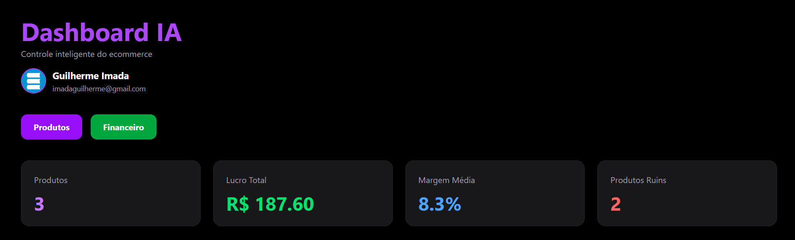
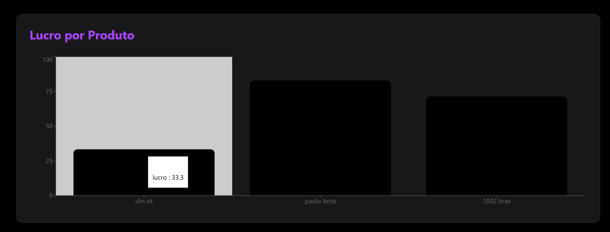
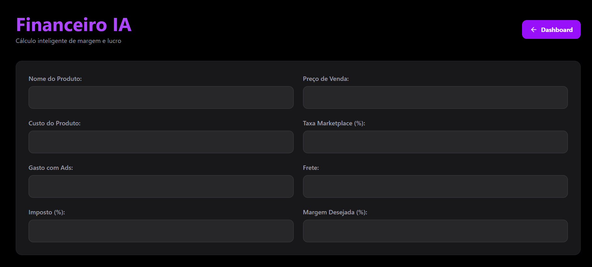
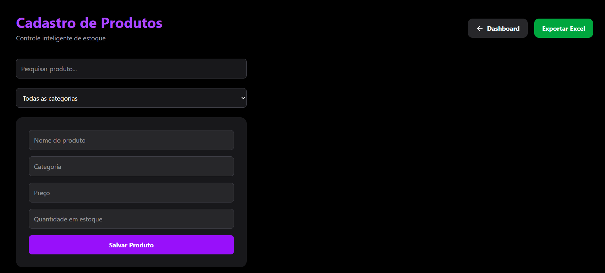
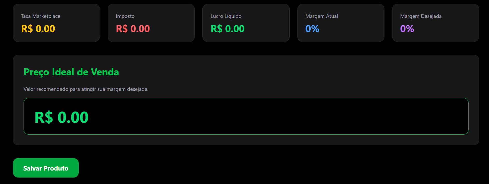
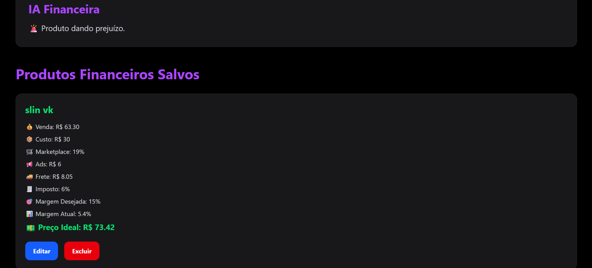

# 🚀 Market Sync AI

Sistema inteligente para controle de estoque, gestão financeira e análise de lucro para e-commerce.

---

## 🌎 Aplicação Online

Acesse o projeto:

https://market-sync-ai.vercel.app

---

# 📌 Sobre o Projeto

O Market Sync AI é uma plataforma desenvolvida para auxiliar vendedores de e-commerce no controle de estoque, análise financeira e precificação inteligente de produtos.

O sistema permite cadastrar produtos, controlar estoque, calcular margens de lucro, analisar custos operacionais e visualizar indicadores através de dashboards interativos.

---

# 🎯 Objetivos

* Controle de estoque
* Gestão financeira
* Precificação inteligente
* Análise de lucro
* Dashboard de indicadores
* Organização de produtos
* Multiusuário com autenticação Google

---

# 🧠 Inteligências Utilizadas

O sistema possui cálculos inteligentes para:

✅ Margem Atual

✅ Margem Desejada

✅ Lucro Líquido

✅ Taxas de Marketplace

✅ Impostos

✅ Frete

✅ Precificação Ideal

✅ Análise Financeira

---

# ⚙️ Tecnologias Utilizadas

## Frontend

* React
* TypeScript
* Vite
* Tailwind CSS

## Backend

* Firebase Authentication
* Firebase Firestore

## Bibliotecas

* Recharts
* Lucide React
* XLSX

---

# 🔐 Autenticação

O sistema utiliza:

* Login com Google
* Firebase Authentication
* Controle Multiusuário
* Dados isolados por usuário

Cada usuário visualiza apenas seus próprios produtos e análises financeiras.

---

# 📦 Gestão de Produtos

Funcionalidades:

* Cadastro de produtos
* Edição de produtos
* Exclusão de produtos
* Controle de estoque
* Categorias
* Pesquisa inteligente
* Filtros
* Exportação para Excel

---

# 💰 Financeiro Inteligente

Permite calcular:

* Custo do produto
* Taxa do marketplace
* Gastos com anúncios
* Frete
* Impostos
* Lucro líquido
* Margem atual
* Margem desejada
* Preço ideal de venda

Além disso, é possível salvar análises financeiras para consultas futuras.

---

# 📊 Dashboard Inteligente

O Dashboard apresenta:

* Total de produtos
* Lucro total
* Margem média
* Produtos com baixa margem
* Gráfico de lucro por produto
* Gráfico de saúde financeira

---

# 🖼️ Screenshots

## Dashboard Principal



---

## Lucro por Produto



---

## Saúde Financeira


---

## Gestão de Produtos



---

## Cálculo Financeiro



---

## Resultado Financeiro



---

## Produtos Financeiros Salvos



---

# 📂 Estrutura do Projeto

```bash
src/
│
├── pages/
│   ├── Dashboard
│   ├── Products
│   ├── Finance
│
├── routes/
├── services/
├── context/
├── components/
```

---

# 🚀 Como Executar

Clone o projeto:

```bash
git clone https://github.com/GuilhermeImada2810/market-sync-ai.git
```

Instale as dependências:

```bash
npm install
```

Execute o projeto:

```bash
npm run dev
```

---

# 🔥 Funcionalidades Desenvolvidas

* [x] Login Google
* [x] Firebase Auth
* [x] Firestore
* [x] Multiusuário
* [x] Dashboard
* [x] Controle de Estoque
* [x] Gestão Financeira
* [x] Cálculo de Margem
* [x] Cálculo de Impostos
* [x] Cálculo de Frete
* [x] Exportação Excel
* [x] Gráficos Interativos
* [x] Produtos Financeiros Salvos
* [x] CRUD Completo

---

# 👨‍💻 Autor

### Guilherme Imada

Estudante de Sistemas de Informação

GitHub:

https://github.com/GuilhermeImada2810
